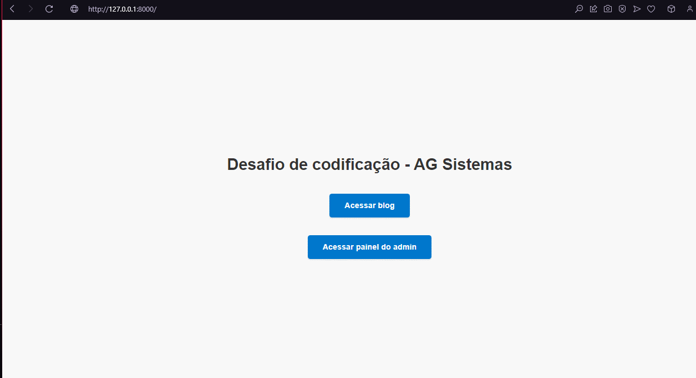

# Desafio de codificação - AG Sistemas
## Autor: Luan Fellipe (allen08)

### Descrição:
Neste desafio, você deverá criar uma aplicação Django que simule um pequeno blog.
Teremos uma listagem de posts em nosso blog.
Você deverá criar um app do Django com o nome core e os seguintes models:
- Post
	Dados: title, content, created_at, tags (um post tem uma ou várias tags e uma tag pode ter um ou vários posts).
- Tag
	Dados: name
Estes 2 models devem estar plugados no admin do Django.
Crie uma página com o path /blog e liste todos os posts e tags da aplicação.
Faça tudo com SQLite3 e acrescente no controle de versão com Git.
Precisa já ter cadastrado um usuário no admin com as seguintes credenciais: admin para o username, admin para a senha

## Exemplo de execução

### [*] Adicionar novo Post:

### [*] Ver posts:

